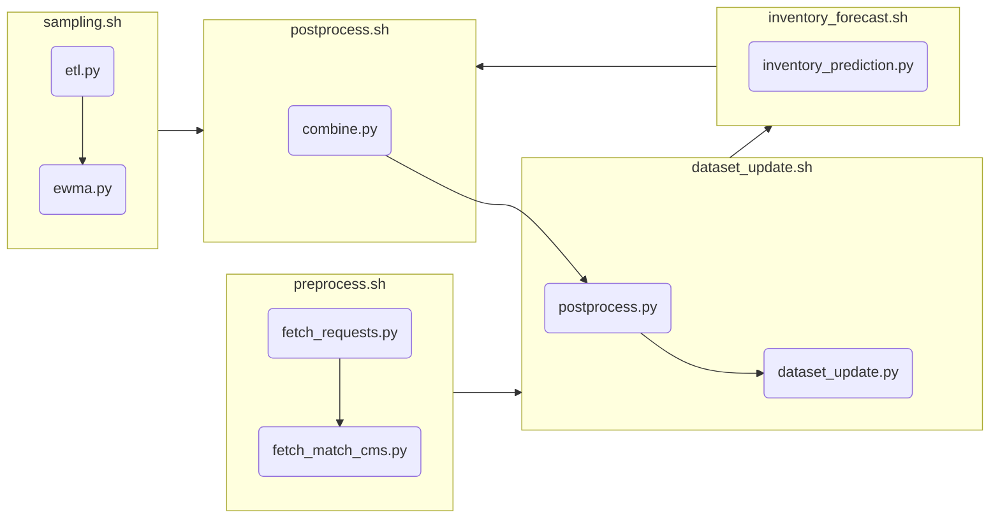

# Pipeline Flowchart

```mermaid
graph LR
  subgraph preprocess.sh
    direction TB
    A(fetch_requests.py) --> B(fetch_match_cms.py)
  end
  subgraph dataset_update.sh
    direction TB
    H(dau_update.py) --> I(dataset_update.py)
  end
  subgraph inventory_forecast.sh
    direction TB
    C(inventory_prediction.py)
  end
  subgraph sampling.sh
    direction TB
    E(etl.py) --> F(ewma.py)
  end
  subgraph postprocess.sh
    G(combine.py) --> H(postprocess.py)
  end
  preprocess.sh --> dataset_update.sh --> inventory_forecast.sh --> postprocess.sh
  sampling.sh --> postprocess.sh
```
