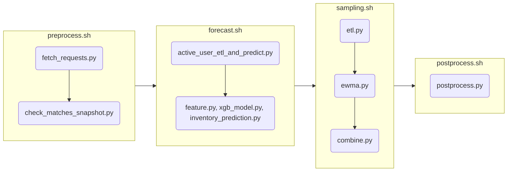

# Pipeline Flowchart

```mermaid
graph LR
  subgraph preprocess.sh
    direction TB
    A(fetch_requests.py) --> B(check_matches_snapshot.py)
  end
  subgraph forecast.sh
    direction TB
    C(active_user_etl_and_predict.py) --> D(feature.py, xgb_model.py, inventory_prediction.py)
  end
  subgraph sampling.sh
    direction TB
    E(etl.py) --> F(ewma.py) --> G(combine.py)
  end
  subgraph postprocess.sh
    H(postprocess.py)
  end
  preprocess.sh --> forecast.sh --> sampling.sh --> postprocess.sh
```
